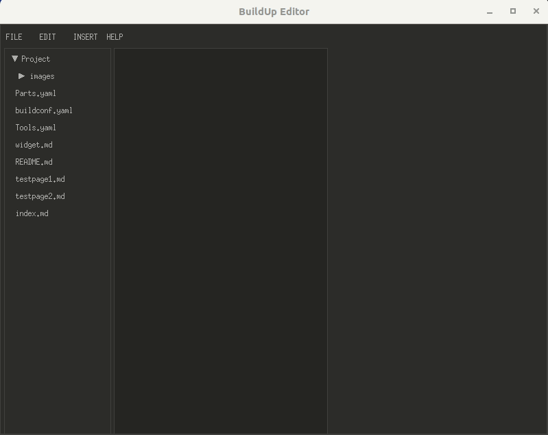

# buildup-editor

**NOTE:** This applicaiton is in the early stages and is not ready for wide-spread use yet.

An editor designed to help open hardware developers create documentation in [BuildUp markdown](https://gitbuilding.io/usage/buildup). Developed as a stand-alone alternative to [GitBuilding](https://gitbuilding.io/), while still generating documentation compatible with GitBuilding. GitBuilding is built using the Python programming lanugage and includes a web server component, whereas BuildUp Editor is a stand-alone C application.

Below is a view of the early alpha.

